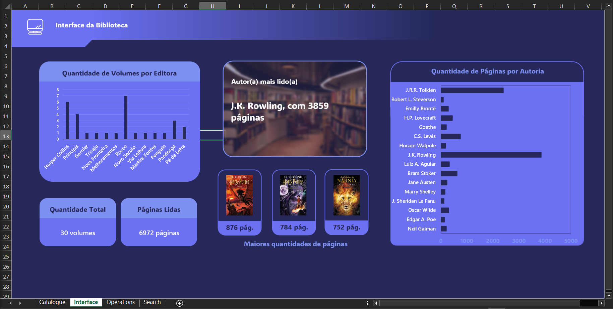
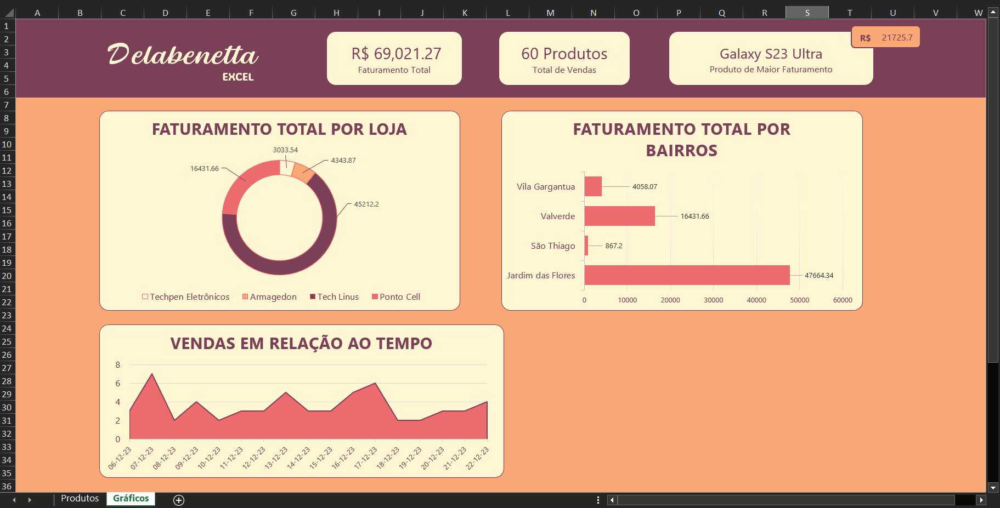

# Dashboards Excel
 <!-- MICROSOFT -->
 <!-- EXCEL -->
 <!-- README -->

 

## 💻 Projeto

Projeto contendo alguns dashboards realizados para treinamento na tecnologia Microsoft Excel.

 

Estes dashboards foram realizados inteiramente por mim, tendo sido um meio para aplicar os estudos de comandos e funções do Excel. Além disso, o design dentro da ferramenta permite uma melhor apresentação dos projetos, levando à interfaces mais interessantes e atrativas.

 

## Preview

Para uma pré-visualização do projeto, deixarei abaixo algumas imagens dos dashboards que se encontram disponíveis na extensão .xlsx dentro da pasta de <a href="./assets/planilhas/">planilhas</a>.

 

<i>Dashboard para gerenciamento e organização de livros para biblioteca pessoal.</i>

<i>Dashboard para visualização dos resultados de venda de algumas lojas de hardware (fictícias).</i>

 

## 🛠 Tecnologias

Esse projeto foi desenvolvido com as seguintes ferramentas e tecnologias:

- Microsoft Excel;
- Virtual Studio Code;
- Git.
